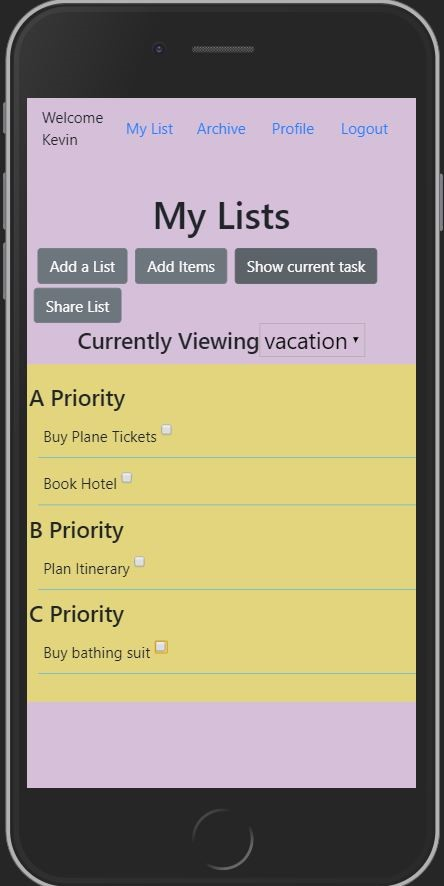

## Prioritiser



Prioritiser is a list-based app designed to increase efficiency and keep you on track by prioritizing your day-to-day tasks.

Built with React, and based on strategies from "Seven Habits of Highly Successful People," Prioritiser asks you to rank or grade every item on a given list and lets you work your way down from most important to least.

The app also features an archive to look up completed lists and the ability to share lists with other users.


## Installation

Use the package manager NPM to install the following:

```bash
npm i --save react-router-dom
npm install --save bootstrap
npm install --save reactstrap react react-dom
npm instal moment --save
npm install chart.js --save

npm start from the root directory to run application
```

## Database sample
Create a json file, database.json,  using the provided data, and run the server on port 8088
```
{
  "users": [
    {
      "id": 1,
      "name": "James",
      "email": "james@james.com",
      "password": "123",
      "picture": "https://res.cloudinary.com/durw1hitu/image/upload/v1581609417/prioritiserfolder/James_Photo_hutqyt.png"
    }
  ],
  "tasks": [
    {
      "taskItem": "buy plane tickets",
      "userId": 2,
      "grade": "A",
      "taskDetail": "",
      "completionDate": "02/21/2020",
      "isCompleted": true,
      "listId": 1,
      "id": 1
    }
  ],
  "lists": [
    {
      "name": "Vacation",
      "userId": 2,
      "archived": false,
      "id": 1
    },
    {
      "name": "Prioritiser",
      "userId": 1,
      "archived": true,
      "id": 2
    }
  ],
  "sharedLists": [
    {
      "initiateUser": 1,
      "userId": 3,
      "listId": 3,
      "id": 2
    }
  ]
}
```
## Usage
1. Register as a new user/ login with existing username and password.
2. Create a new list by clicking 'Add a List'
3. Click 'Add Items', then select a list, enter information about the given item, and select a grade, then click 'log new task'.
4. Your highest priority task will appear first ranking from 'A-D'. Click 'Show all' to view all items.
5. Click 'share list' to send any incomplete lists to another user.
6. Click an individual item to add additional details, edit the item, or delete the item. Click the checkbox once complete to cross off an item and move on to the next highest priority.
7. Completion off all tasks will present an 'archive list' button. Click to add list to the archive.
7. Select 'Archive' from the navigation bar to view completed tasks.
8. Search by either keyword and press 'enter' or date to see found tasks.
9. Select 'profile' from the navigation bar to view user's personal profile picture, a bar graph detailing the tasks they have completed, and all lists that have been shared.

